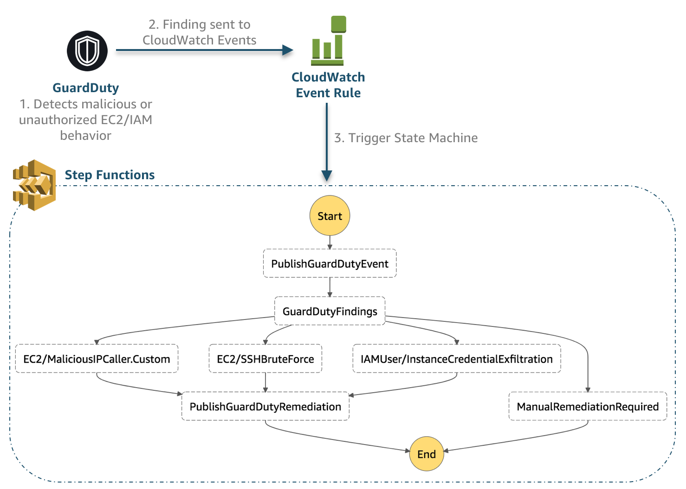

# GuardDuty Remediation Workflow with Step Functions

This serverless application...

## Architecture



### State Machine Workflow Details


## Prerequisites

Below are the necessary prerequisites:

*	[AWS Account](https://aws.amazon.com/premiumsupport/knowledge-center/create-and-activate-aws-account/)
*	[AWS CLI](https://aws.amazon.com/cli/)
*	[pip](https://pypi.org/project/pip/)

### Cloud9 Environment

If you have trouble installing any of the prerequisites or dependencies, you can spin up an [AWS Cloud9](https://aws.amazon.com/cloud9/) environment, which is a cloud-based IDE that comes prepackaged with a number of essential packages.

## Install Dependencies

After cloning the repo, change to the aws-ct-processing directory and run the following to install the dependencies:

```
pip install -r requirements.txt -t ./
```

## Setup Environment

Before you deploy the SAM template for your serverless application you need to setup a number of resources manually.

### Create a Slack Bot

### AWS Resources

#### Create an S3 Bucket

In order to package and deploy SAM templates you need to have an S3 bucket where you can upload your artifacts.  If you don't already have a bucket you plan on using you can run the command below to create one.

```
aws s3api create-bucket --bucket <BUCKET NAME> --region <REGION>
```

### Create Parameter

For this application you need to manually create a Parameter in AWS Systems Manager Parameter Store for your Slack Bot Token.

```
aws ssm put-parameter --name "<INSERT NAME>" --type "SecureString" --value "<INSERT SLACK TOKEN>"
```

>	To quickly get started use **bot-token-guardduty** for the parameter name which is the default name when deploying the application.
### Create Inspector Role

### Create Slack Bot

## Deploy


